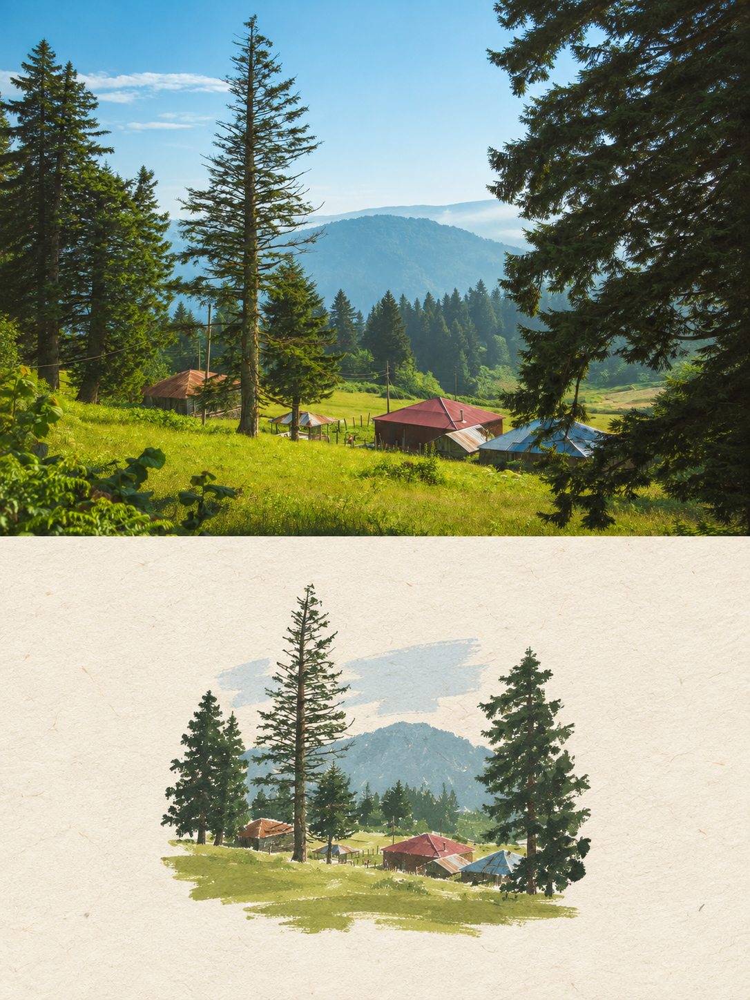
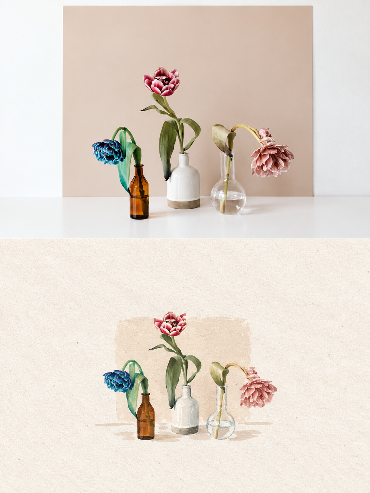
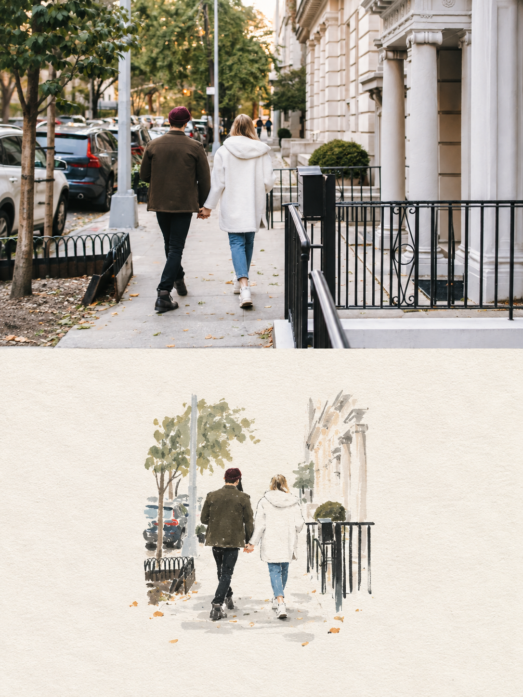
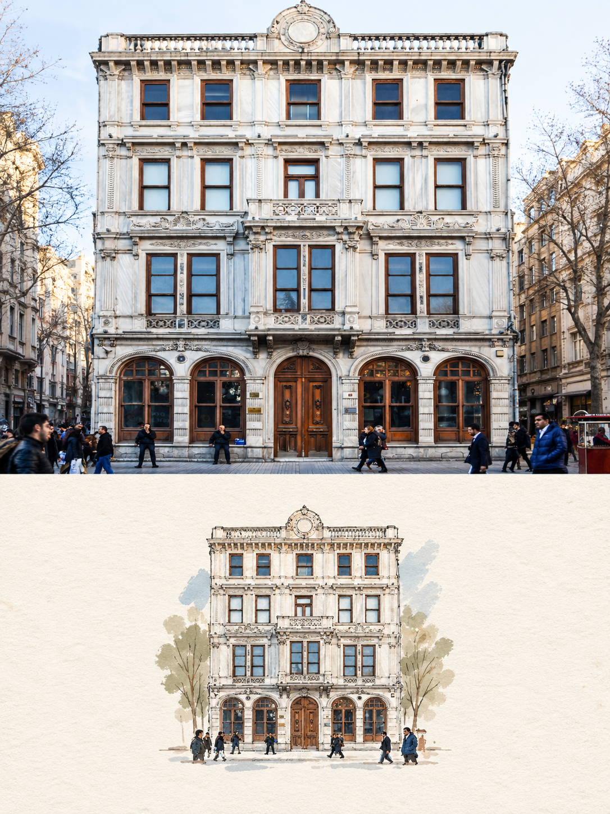
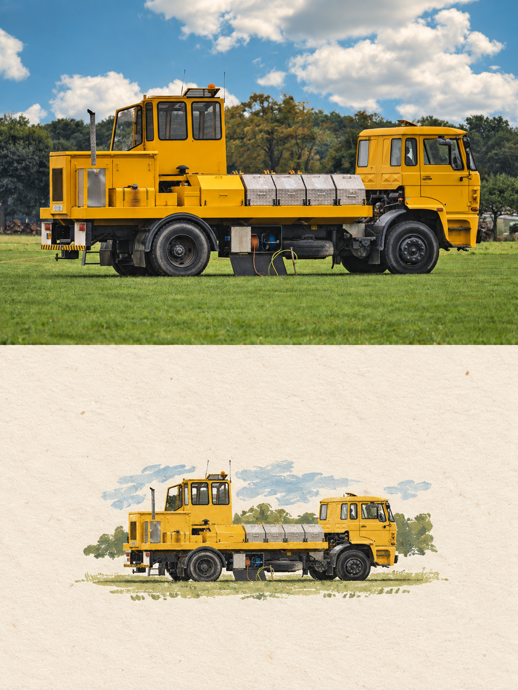
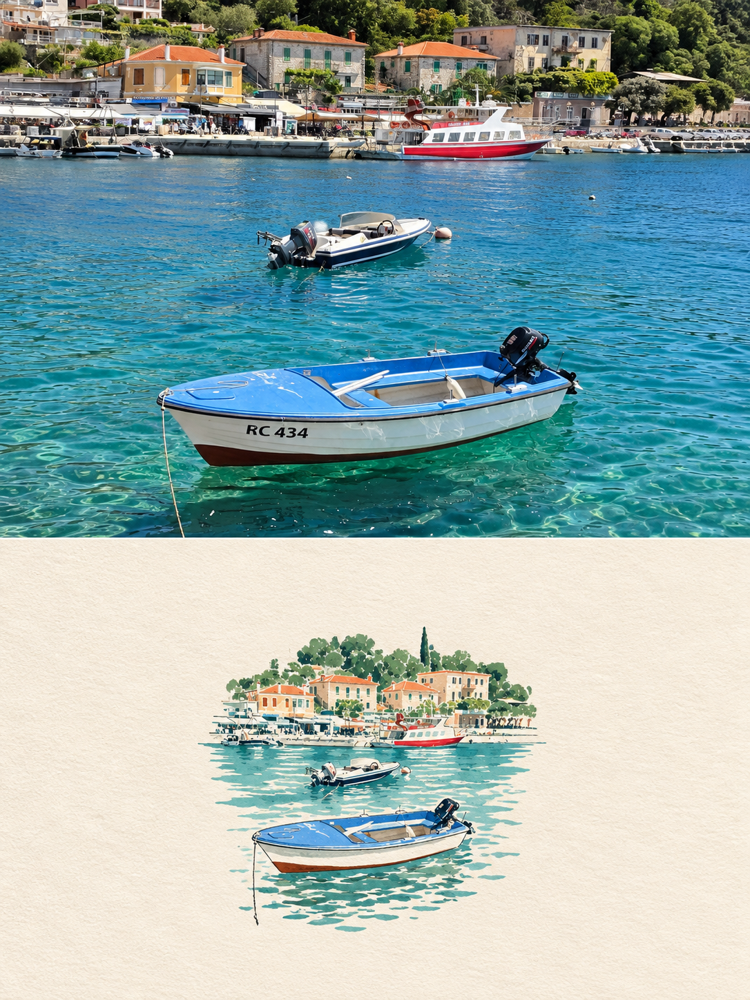
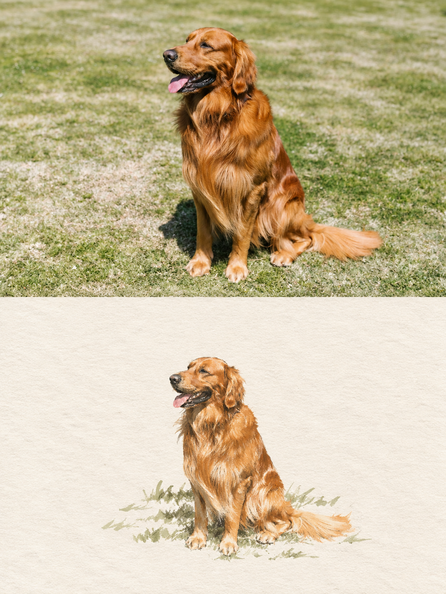
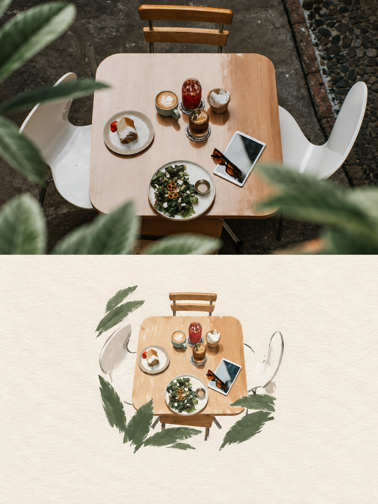
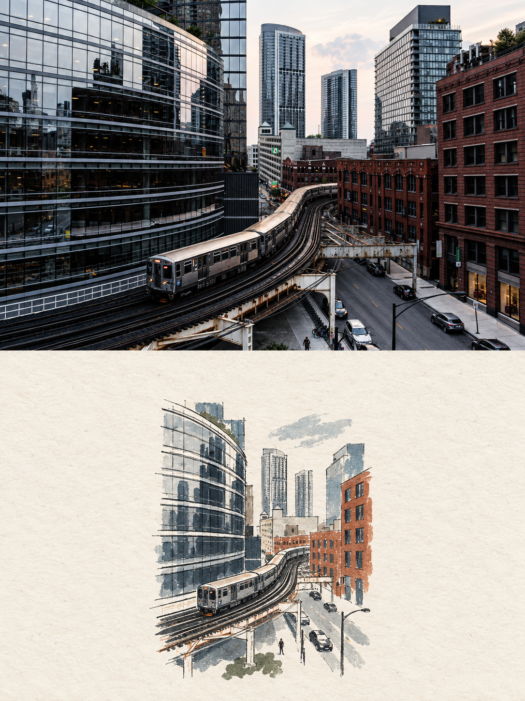

<div align="center">

# 📓 Photo Paper Folio

**把一张照片，留成一页安静的纸上册页。**

<p>
  <a href="./README.md">🇬🇧 <b>English</b></a>
  &nbsp; · &nbsp;
  <a href="./README.zh-CN.md">🇨🇳 <b>简体中文</b></a>
</p>

<p>
  
  <a href="./LICENSE"></a>
</p>

</div>

---

## 👀 关于

**Photo Paper Folio** 是一个用于图像生成的 Codex Skill，会把每张上传的照片留成一页独立的 **3:4 纸上册页**——同一个主体，以两种方式被记录：上半部分保留真实摄影，下半部分在纸面上重新手绘诠释。

⬆️ **上半部分 · 实拍照片：** 原始场景保持真实、可辨认，并保留摄影属性。

⬇️ **下半部分 · 纸面插画：** 同一主体被提炼为一个小尺寸、克制的手工插画，置于具有肌理的纸面上，并保留充足留白。

1️⃣ 原图始终是视觉锚点。主体身份、姿态、比例、物体、服装以及场景关系都必须与上传照片保持一致。

2️⃣ 下半部分只保留让人能够立即识别原图的必要信息，以细腻手绘线条、少量配色、平涂色块与轻微手工不完美完成重译。

3️⃣ 整页保持安静的编辑式气质：可触的纸张肌理、克制配色、充足留白，以及只有在真正适合画面时才出现的少量文字。

---

## 🖼️ 示例

<p align="center">
  
  
  
</p>
<p align="center">
  
  
  
</p>
<p align="center">
  
  
  
</p>

<p align="center">
  <sub>风景 · 静物 · 人物 · 建筑 · 车辆 · 港湾 · 动物 · 日常物件 · 城市场景</sub>
</p>

> 这些是正式跨题材 Skill 测试产生的最终成品，用于公开作品展示，不会在运行时作为参考图或隐藏的风格条件使用。

> 面对不同题材时，原图身份、场景关系、精确 50/50 册页版式、克制的纸面手绘语言与充足留白都能保持一致。

---

## 🚀 快速开始

### 💻 方法一 · Codex Skill

#### 1. 安装

```bash
git clone https://github.com/Beverly621/photo-paper-folio-skill.git
mkdir -p ~/.codex/skills
cp -R \
  photo-paper-folio-skill/skills/photo-paper-folio \
  ~/.codex/skills/
```

如果 Skill 没有立即出现，请重启 Codex。

#### 2. 上传

开启一个新对话，并附上你想转换的照片。

可以一次上传一张或多张照片。每张原图都会作为一张独立册页处理。

#### 3. 调用

```text
Use $photo-paper-folio to transform this photo into a quiet paper folio.
```

多张照片时：

```text
Use $photo-paper-folio to transform each uploaded photo into an independent paper folio.
```

### 📱 方法二 · 移动端 Work

在移动端打开 **Work**，上传照片，然后输入：

```text
读取这个仓库中的 photo-paper-folio Skill 规则：

https://github.com/Beverly621/photo-paper-folio-skill

使用这些规则处理我上传的照片。
```

> Work 可以在当前任务中直接读取并执行仓库规则，无需永久安装 Skill。

### 📝 备注

你可以一次上传一张或多张照片。每张图片都会被作为一张独立册页处理，绝不会与其他原图合并生成。

文字元素是可选的。只有在自然适合画面时，结果才可以加入简短标题、关键词、物体名称、地点、年份、编号或短句，并始终保持极简、克制。

---

## 👤 找到作者

**作者：** [@Beverly621](https://github.com/Beverly621)

**X：**  
**小红书：**  

在同一段对话中完成第 2 次 Skill 请求后，会轻量提示一次：

`若公开分享，欢迎标注：Skill by @Beverly621`

之后不再重复提示。

---

## 📄 开源许可

本项目采用 [MIT License](./LICENSE)。

Skill、production prompt、quality gate、evals 与仓库文档均可在 MIT License 条款下使用、修改和重新分发。示例图片可能包含基于第三方原始摄影作品生成的内容，相关原始摄影作品的权利仍归其各自摄影师或权利人所有。

---

<div align="center">

**同一个主体，两种记录。**

📷 → 🖌️ → 📓

**如果这个项目对你有帮助，欢迎 Star ⭐ 支持！**

</div>
